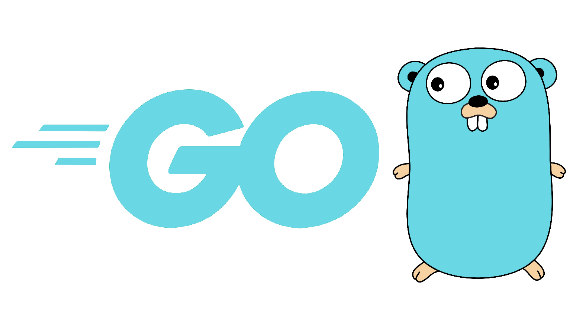

<h1 align="center">Hi 👋, I'm Dhananjay a.k.a Dj </h1>

### 👨🏻‍💻 &nbsp;About Me 

- 💡 I am a passionate self-taught programmer and think of myself as a lifelong learner.
- 🌱 I believe that knowledge sharing is the ultimate form of learning.
- ✍ In my free time, I write blogs on [djcodes.wordpress.com](https://djcodes.wordpress.com/), [stackabuse](https://stackabuse.com/author/dhananjay/), and as an anonymous writer on other platforms.

## ⚙ GitHub Analytics

## 🛠 Tech Stack

### Languages

 

### Frameworks

### Data Layers  

### Bockchains and frameworks

### CI/CD and DevOps

### Performance and Monitoring Tools

### Other Stuffs

